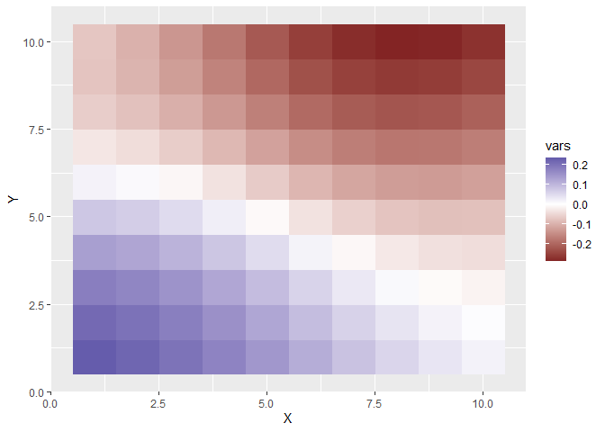
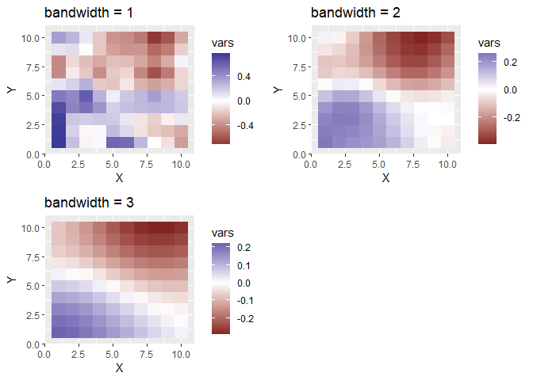

<!-- README.md is generated from README.Rmd. Please edit that file -->

# Geographically Weighted Poisson Regression

<!-- badges: start -->

<!-- badges: end -->

## Installation

You can install the package from
[GitHub](https://github.com/hoxo-m/gwpr).

``` r
install.packages("remotes") # if you have not installed "remotes" package
remotes::install_github("hoxo-m/gwpr")
```

## Example

``` r
set.seed(123)
df <- lctools::random.test.data(10, 10, 2, "poisson")
head(df)
#>   dep      vars X Y
#> 1   5 0.2387260 1 1
#> 2   9 0.9623589 1 2
#> 3   6 0.6013657 1 3
#> 4  10 0.5150297 1 4
#> 5  11 0.4025733 1 5
#> 6   3 0.8802465 1 6
```

``` r
library(gwpr)
df_coord <- df[c("X", "Y")]
params <- gwpr(df, dep ~ vars, df_coord,
               kernel = "gaussian", bandwidth = 1)
```

``` r
library(ggplot2)
df_gg <- cbind(params, df_coord)
ggplot(df_gg, aes(X, Y)) + geom_raster(aes(fill = vars)) +
  scale_fill_gradient2()
```



### Change bandwidth

``` r
params_bw2 <- gwpr(df, dep ~ vars, df_coord,
                   kernel = "gaussian", bandwidth = 2)
params_bw3 <- gwpr(df, dep ~ vars, df_coord,
                   kernel = "gaussian", bandwidth = 3)
```

``` r
df_gg_bw2 <- cbind(params_bw2, df_coord)
df_gg_bw3 <- cbind(params_bw3, df_coord)

p1 <- ggplot(df_gg, aes(X, Y)) + geom_raster(aes(fill = vars)) +
  scale_fill_gradient2() + ggtitle("bandwidth = 1")
p2 <- ggplot(df_gg_bw2, aes(X, Y)) + geom_raster(aes(fill = vars)) +
  scale_fill_gradient2() + ggtitle("bandwidth = 2")
p3 <- ggplot(df_gg_bw3, aes(X, Y)) + geom_raster(aes(fill = vars)) +
  scale_fill_gradient2() + ggtitle("bandwidth = 3")

cowplot::plot_grid(p1, p2, p3)
```



## References

  - Nakaya, Tomoki & Fotheringham, Alexander & Brunsdon, Chris &
    Charlton, Martin. (2005). Geographically Weighted Poisson Regression
    for Disease Association Mapping. Statistics in medicine. 24.
    2695-717. 10.1002/sim.2129.

## Related Work

  - [spgwr: Geographically Weighted
    Regression](https://cran.r-project.org/package=spgwr)
  - [lctools: Local Correlation, Spatial Inequalities, Geographically
    Weighted Regression and Other
    Tools](https://cran.r-project.org/package=lctools)
